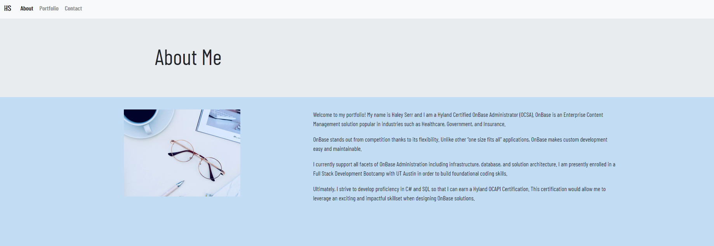
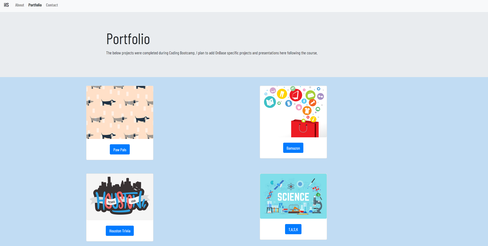
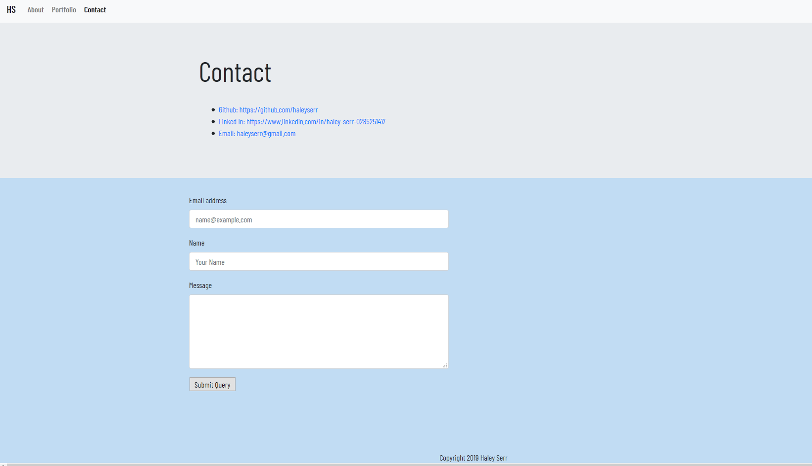

# Bootstrap-Portfolio
Re-Create Portfolio using Bootstrap CSS

Hello! This is my portfolio. It still has a ways to go, but please look around!

# Screenshots

My asthetic is simple and cool-toned. There is a purposful effort to avoid "clutter".

A "real-life" photo of my appearance was intentionally left out.

# Git Hub Repo's 

# Contact Information

Email: haleyserr@gmail.com

